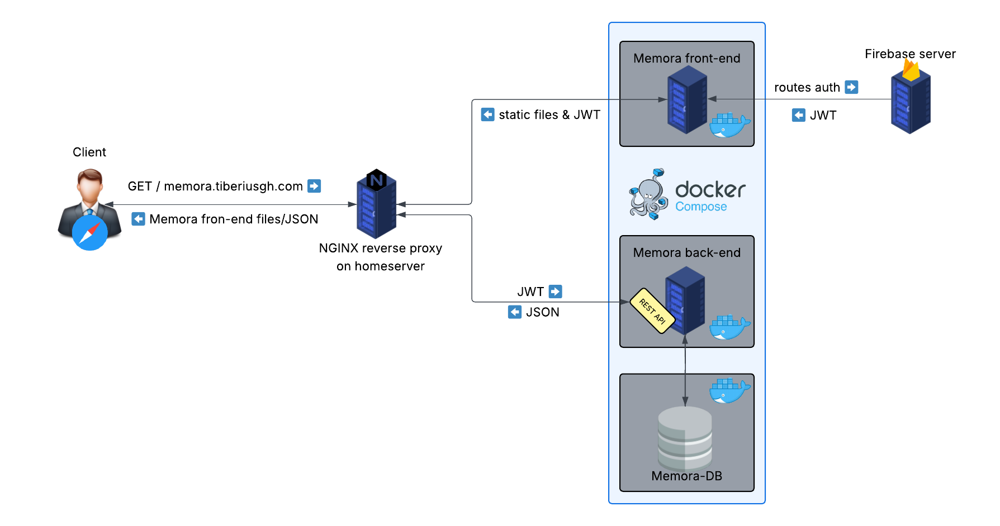

# Memora Orchestrator

Docker Compose orchestration for the complete Memora application stack - a streamlined setup for running the application with all its components.

## Architecture Overview



The Memora application consists of three main components:

- **Frontend**: Web Components-based user interface
- **Backend**: Node.js API server with Firebase authentication
- **Database**: MongoDB for data persistence
- **Nginx** (Production): Reverse proxy and load balancer

## Prerequisites

- Docker and Docker Compose installed
- The following repositories cloned in the same parent directory:
  ```
  parent-directory/
  ├── orchestrator/           # This repository
  ├── memora_back_end/       # Backend repository
  └── memora_front_end/      # Frontend repository
  ```

## Quick Start

### 1. Clone All Repositories

```bash
# Clone the orchestrator (this repository)
git clone https://github.com/Memora-Tiberiusgh/orchestrator

# Clone backend and frontend repositories in the same directory
git clone https://github.com/Memora-Tiberiusgh/memora_back_end
git clone https://github.com/Memora-Tiberiusgh/memora_front_end
cd orchestrator
```

### 2. Environment Configuration

Configure the backend environment variables:

```bash
# Edit the backend .env file with your Firebase and other configuration
# Follow the setup instructions in the backend README
```

### 3. Choose Your Environment

#### Development Environment

```bash
# Start the development stack
docker-compose -f docker-compose.dev.yml up --build

# Or run in detached mode
docker-compose -f docker-compose.dev.yml up -d --build
```

## Development Setup (docker-compose.dev.yml)

The development environment provides:

- **Hot reload** for both frontend and backend
- **Volume mounting** for live code changes
- **Development-optimized** containers
- **Direct port access** for debugging

### Services:

- **MongoDB**: `localhost:27017`
- **Backend API**: `localhost:8186`
- **Frontend**: `localhost:5173`

### Features:

- Automatic restart on code changes
- Development environment variables
- Node modules optimization with anonymous volumes
- Real-time synchronization with local file changes

```yaml
# Development containers with volume mounting for hot reload
volumes:
  - ../memora_back_end:/backend
  - ../memora_front_end:/frontend
  - /backend/node_modules # Anonymous volume for node_modules
  - /frontend/node_modules
```

## Production Setup (docker-compose.yml)

The production environment provides:

- **Optimized containers** built for production
- **Environment variable configuration** via .env file
- **Proper restart policies**
- **Network isolation**

### Environment Variables (.env):

```env
BACKEND_IMAGE=your-registry/memora-backend:latest
FRONTEND_IMAGE=your-registry/memora-frontend:latest
```

### Building Production Images:

Before running the production compose, build and push your images:

```bash
# Build and tag backend image
cd ../memora_back_end
docker build -f Dockerfile -t your-registry/memora-backend:latest .
docker push your-registry/memora-backend:latest

# Build and tag frontend image
cd ../memora_front_end
docker build -f Dockerfile.prod -t your-registry/memora-frontend:latest .
docker push your-registry/memora-frontend:latest
```

## Nginx Reverse Proxy (Production)

For production deployments, nginx acts as a **traffic director** that routes requests appropriately:

- **API requests** (`/api/*`) → Backend server (port 8186)
- **Static assets and app routes** → Frontend server (port 5173)

### Nginx Configuration

Add this configuration to your nginx server:

```nginx
server {
    listen 80;
    server_name your-domain.com; # Replace with your actual domain

    # Route API requests to backend container
    location /api/ {
        proxy_pass http://localhost:8186;
        proxy_set_header Host $host;
        proxy_set_header X-Real-IP $remote_addr;
        proxy_set_header X-Forwarded-For $proxy_add_x_forwarded_for;
        proxy_set_header X-Forwarded-Proto $scheme;
    }

    # Route all other requests to frontend container
    location / {
        proxy_pass http://localhost:5173;
        proxy_set_header Host $host;
        proxy_set_header X-Real-IP $remote_addr;
        proxy_set_header X-Forwarded-For $proxy_add_x_forwarded_for;
        proxy_set_header X-Forwarded-Proto $scheme;

        # Support for WebSocket connections (if needed for hot reload)
        proxy_http_version 1.1;
        proxy_set_header Upgrade $http_upgrade;
        proxy_set_header Connection "upgrade";
    }
}
```

### SSL/HTTPS Configuration (Recommended)

For production, add SSL certificate support:

```nginx
server {
    listen 443 ssl http2;
    server_name your-domain.com;

    ssl_certificate /path/to/your/certificate.crt;
    ssl_certificate_key /path/to/your/private.key;

    # SSL configuration
    ssl_protocols TLSv1.2 TLSv1.3;
    ssl_ciphers ECDHE-RSA-AES256-GCM-SHA512:DHE-RSA-AES256-GCM-SHA512;
    ssl_prefer_server_ciphers off;

    # Your location blocks here (same as above)
    location /api/ { ... }
    location / { ... }
}

# Redirect HTTP to HTTPS
server {
    listen 80;
    server_name your-domain.com;
    return 301 https://$host$request_uri;
}
```

## Container Overview

| Service  | Development Port | Production Port | Purpose          |
| -------- | ---------------- | --------------- | ---------------- |
| MongoDB  | 27017            | 27017           | Database storage |
| Backend  | 8186             | 8186            | API server       |
| Frontend | 5173             | 3000            | Web application  |

## Common Commands

### Development Commands:

```bash
# Start development environment
docker-compose -f docker-compose.dev.yml up

# Rebuild and start (after code changes to Dockerfiles)
docker-compose -f docker-compose.dev.yml up --build

# View logs
docker-compose -f docker-compose.dev.yml logs -f [service-name]

# Stop all services
docker-compose -f docker-compose.dev.yml down

# Stop and remove volumes (clean slate)
docker-compose -f docker-compose.dev.yml down -v
```

### Production Commands:

```bash
# Start production environment
docker-compose -f docker-compose.prod.yml up -d

# Update production deployment
docker-compose -f docker-compose.prod.yml pull
docker-compose -f docker-compose.prod.yml up -d

# View production logs
docker-compose -f docker-compose.prod.yml logs -f

# Scale services (if needed)
docker-compose -f docker-compose.prod.yml up -d --scale backend=2
```

### Maintenance Commands:

```bash
# Execute commands in running containers
docker-compose exec backend npm run lint
docker-compose exec mongodb mongosh

# Access container shell
docker-compose exec backend sh
docker-compose exec frontend sh

# Monitor resource usage
docker stats
```

## Deployment Strategies

### Single Server Deployment:

Use the provided docker-compose files with nginx reverse proxy.

### Container Registry Workflow:

1. Build images locally or in CI/CD
2. Push to container registry
3. Update .env with image references
4. Deploy using docker-compose.prod.yml

## 🤝 Contributing

1. Fork the repository
2. Create a feature branch
3. Test with both development and production compose files
4. Submit a pull request

## License

This project is licensed under the MIT License.

## Support

For issues and feature requests, please visit our [GitHub Discussions](https://github.com/orgs/Memora-Tiberiusgh/discussions) or contribute to the project at [GitHub organization](https://github.com/Memora-Tiberiusgh).

## Author

**Tiberius Gherac** - [tiberius.gherac@gmail.com](mailto:tiberius.gherac@gmail.com)  
First-year Web Development Student @ Linnaeus University  
GitHub: [@TiberiusGh](https://github.com/TiberiusGh)

---
